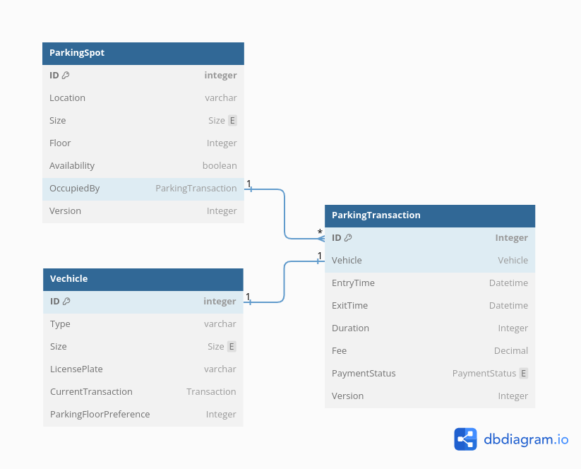
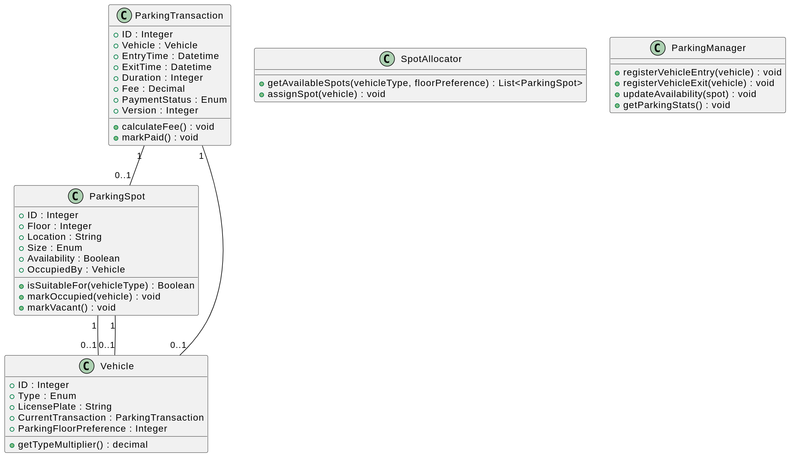

# Parking lot lld

Low-level architecture for a backend system of a smart parking lot, handles vehicle entry and exit management, parking space allocation, and fee calculation.

### Design Aspects

**1. Data Model**

* **Purpose:** Efficiently store, retrieve, and manage parking data.

## Classes and Relationships

**Key Classes:**

* **ParkingSpot:**
  * Represents a single parking space.
  * Attributes: ID, Floor, Location, Size, Availability, OccupiedBy, Version.
  * Methods: isSuitableFor(), markOccupied(), markVacant().
* **Vehicle:**
  * Represents a vehicle using the parking lot.
  * Attributes: ID, Type, LicensePlate, CurrentTransaction, ParkingFloorPreference.
  * Methods: getTypeMultiplier() (optional).
* **ParkingTransaction:**
  * Represents a parking session for a vehicle.
  * Attributes: ID, Vehicle, EntryTime, ExitTime, Duration, Fee, PaymentStatus, Version.
  * Methods: calculateFee(), markPaid().
* **SpotAllocator:**
  * Allocates available parking spots to vehicles.
  * Methods: getAvailableSpots(), assignSpot().
* **ParkingManager:**
  * Manages overall parking operations.
  * Methods: registerVehicleEntry(), registerVehicleExit(), updateAvailability(), getParkingStats().

**Relationships:**

* One-to-one between Vehicle and ParkingTransaction (a vehicle has at most one active transaction).
* Many-to-one between ParkingTransaction and ParkingSpot (multiple transactions can use a spot over time).
* One-to-one between ParkingSpot and Vehicle (if occupied) (a spot can be occupied by only one vehicle at a time).

**Key Concepts:**

* **Optimistic locking:** Used to prevent data conflicts during concurrent updates.
* **Class extensions:** Ability to add more attributes and methods to classes based on specific requirements.

## Diagrams

**2. Algorithm for Spot Allocation**

* **Purpose:** Optimize spot assignment for efficient space utilization and user convenience.
* **Common Approaches:**
    - Nearest Fit: Assigns closest available spot to vehicle's entry point.
    - Size-Based Priority: Prioritizes matching vehicle size to spot size.
    - User Preferences (optional): Incorporates user-specified floor or spot type preferences.

**3. Fee Calculation Logic**

* **Purpose:** Determine accurate parking fees based on duration and vehicle type.
* **Typical Formula:** BaseRate + HourlyRate * (Duration - BaseDuration) * VehicleTypeMultiplier

**4. Concurrency Handling**

* **Purpose:** Prevent data inconsistencies and errors with multiple users.
* **Common Techniques:**
    - Optimistic Locking: Uses version numbers to detect and handle conflicts during updates.
    - Queueing Mechanisms: Manage incoming vehicles when all spots are occupied.
